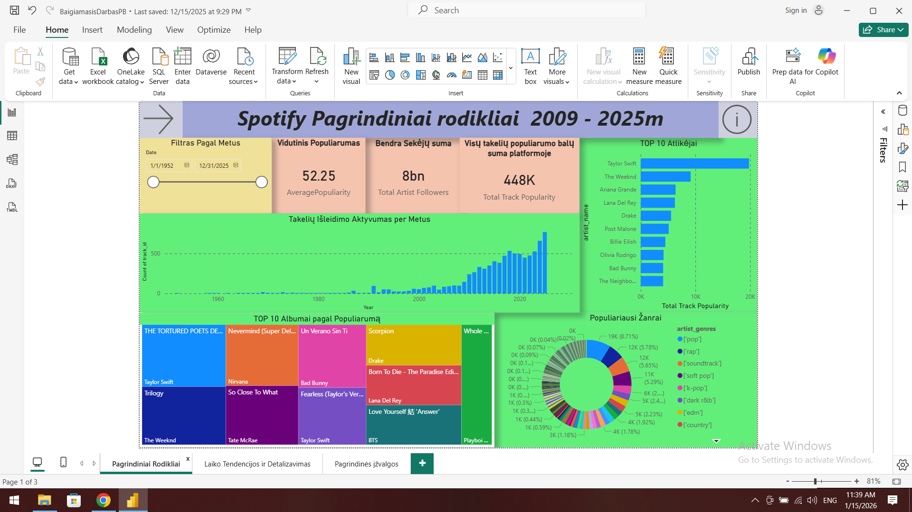
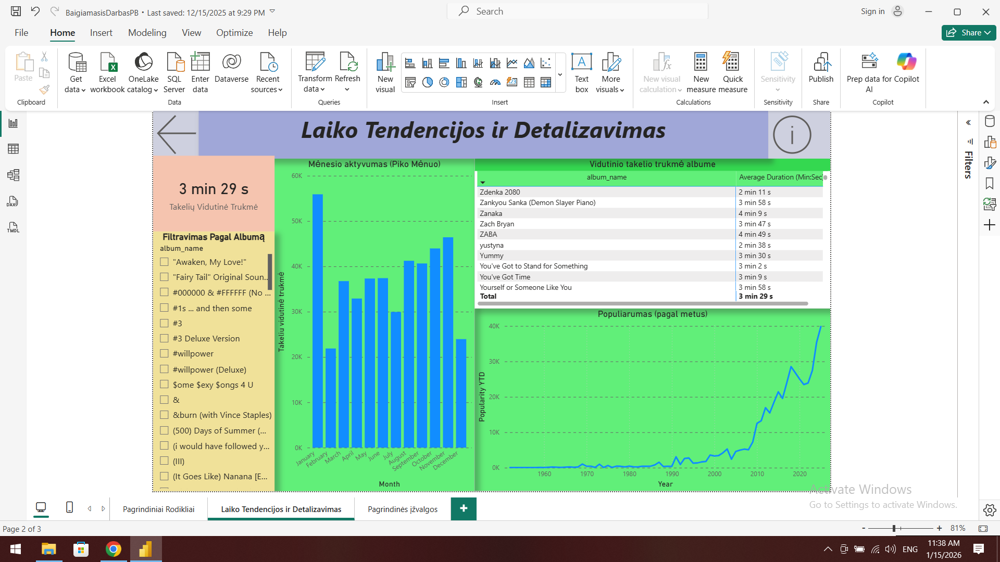

# Spotify Music Data Analysis (2009–2025)

## Project Overview
This project provides a comprehensive analysis of Spotify music trends over a 16-year period. The goal was to transform raw music data into actionable insights, identifying patterns in popularity, genre evolution, and audio characteristics.

## Key Features & Insights
* **Trend Analysis:** Visualizing how music preferences have shifted from 2009 to 2025.
* **Technical Metrics:** Deep dive into track energy, danceability, and acousticness.
* **Artist Performance:** Identification of top-performing artists and tracks using custom KPIs.

## Dashboard Previews
### Main Indicators

### Time Trends & Details

## Technical Toolkit
* **Power BI:** Data visualization and dashboard design.
* **SQL:** Data extraction and management.
* **Power Query (M):** Data transformation (ETL).
* **DAX:** Custom measures for growth and popularity scores.

## About the Author
**Vaidas Vincevičius**
